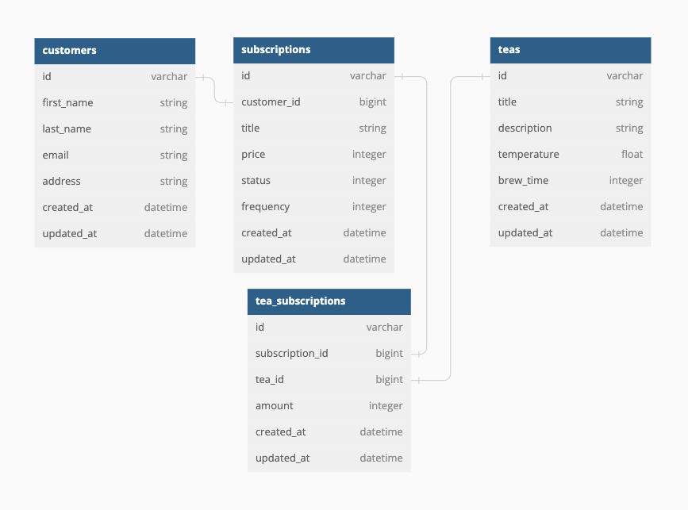

# Tea Subscription API

---

## Database Schema Diagram



---

## API Endpoints


- [Subscribe a customer to a tea subscription](#subscribe-a-customer-to-a-tea-subscription)
- [Cancel a customer's tea subscription](#cancel-a-customer-s-tea-subscription)
- [View all of a customer's subscriptions](#view-all-of-a-customers-subscriptions)
  <br><br>

> ## Subscribe a Customer to a Tea Subscription
>
> POST `/api/v1/customers/1/subscriptions`
>
> Example JSON Body:
>
> ```JSON
> {
>  "title": "Tea-riffic",
>  "price": 15,
>  "frequency": 4,
>  "status": "cancelled",
>  "teas": [
>    {
>      "amount": 1,
>      "tea_id":1
>    },
>    {
>      "amount": 5,
>      "tea_id": 2
>    }
>  ]
>}
> ```
> Example Response:
>
> ```JSON
>{
>    "data": {
>        "id": "9",
>        "type": "subscription",
>        "attributes": {
>            "title": "Tea-riffic",
>            "price": 15,
>            "frequency": 4,
>            "status": "cancelled",
>            "teas": [
>                {
>                   "tea_id": "1",
>                    "amount": 1
>                },
>                {
>                    "tea_id": "2",
>                    "amount": 5
>                }
>            ]
>        }
>    }
>}
> ```

<br><br>

> ## Cancel a Customer's Tea Subscription
>
> PATCH `/api/v1/customers/1/subscriptions/7`
>
> Example JSON Body:
>
> ```JSON
>{
>  "status": "cancelled"
>}
> ```
>
> Example Response:
>
> ```JSON
>{
>    "data": {
>        "id": "7",
>        "type": "subscription",
>        "attributes": {
>            "title": "Tea-riffic",
>            "price": 15,
>            "frequency": 4,
>            "status": "cancelled",
>            "teas": [
>                {
>                    "tea_id": "1",
>                    "amount": 1
>                },
>                {
>                    "tea_id": "2",
>                    "amount": 4
>                }
>            ]
>        }
>    }
>}
> ```
>

<br><br>

> ## View all of a Customer's Tea Subscriptions
>
> GET `/api/v1/customers/1/subscriptions`
>
>
> Example Response:
> ```JSON
>{
>    "data": [
>        {
>            "id": "5",
>            "type": "subscription",
>            "attributes": {
>                "title": "Tea-Time",
>                "price": 5,
>                "frequency": 1,
>                "status": "cancelled",
>                "teas": [
>                    {
>                        "tea_id": "5",
>                        "amount": 3
>                    },
>                    {
>                        "tea_id": "6",
>                        "amount": 8
>                    }
>                ]
>            }
>        },
>        {
>            "id": "6",
>            "type": "subscription",
>            "attributes": {
>                "title": "Tea-m work makes the dream work",
>                "price": 10,
>                "frequency": 3,
>                "status": "active",
>                "teas": [
>                    {
>                        "tea_id": "4",
>                        "amount": 2
>                    },
>                    {
>                        "tea_id": "3",
>                        "amount": 5
>                    }
>                ]
>            }
>        },
>        {
>            "id": "7",
>            "type": "subscription",
>            "attributes": {
>                "title": "Tea-riffic",
>                "price": 15,
>                "frequency": 4,
>                "status": "active",
>                "teas": [
>                    {
>                        "tea_id": "1",
>                        "amount": 1
>                    },
>                    {
>                        "tea_id": "2",
>                        "amount": 4
>                    }
>                ]
>            }
>        }
>    ]
>}
> ```
>

<br><br>

---
